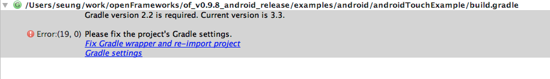
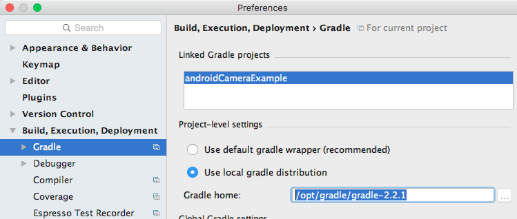

## Versions
* openFrameworks : 0.9.8
* Android studio : 2.3.3.0
* tested in macOS (Sierra)


## Problem
Android Studio 2.3.3.0 is equipped with Gradle 3+, but, openFrameworks (0.9.8) was written for Gradle 2.x (2.2.1).



* Instruction : http://openframeworks.cc/setup/android-studio/

* Error messages when building androidEmptyExample with default settings :
```
Error:(59, 0) Could not get unknown property 'assembleDebug' for root project 'androidEmptyExample' of type org.gradle.api.Project.xamples/android/androidEmptyExample/build.gradle">Open File</a>
```


## Settings
### Gradle : Project-level settings in Android Studio
```
/opt/gradle/gradle-2.2.1
```


* How to setup ?
```
https://gradle.org/install/
https://services.gradle.org/distributions/gradle-2.2.1-bin.zip
```

## Summary
```
Warning: Android Studio 2.3.3.0 requires Gradle 2.14.1 (or newer) but project is using 2.2.1.
It is strongly recommended that you update Gradle to version 2.14.1 or newer.
```
그러나 일단 2.2.1로도 빌드 진행 잘 되었음.
